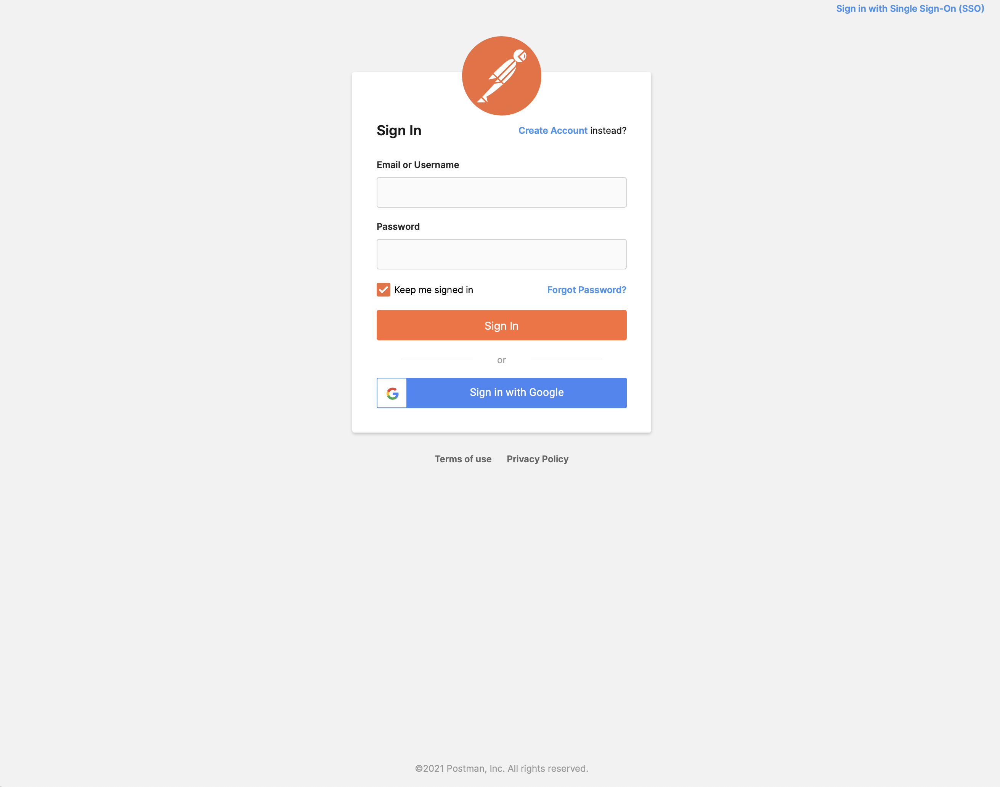

# Python-APIs-Consuming-I

## Consuming APIs with Postman 

In this exercise, students will create an account on Postman' browser based client and consume an API. For this we will use the (Open Notify)[http://open-notify.org] API for "Number of Humans currently in Space". Students will then take time to call open APIs from provided list of Open APIs to get a for Postman.

Open notify is an open source API for up-to-date NASA data from 3 datasets:

1. Current Location of the International Space Station
2. Overhead Pass Predictions for the International Space Station
3. Number of Humans currently in Space

- Open Notify [Source](https://github.com/open-notify)
- Open Notify [Docs](http://open-notify.org/Open-Notify-API/)
- Postman [Docs](https://learning.postman.com/docs/getting-started/introduction/)
 
### Steps

**1. Create a Postman Account**

Go to the [Postman](https://postman.com) website and create an account on the signup page.




**2. Create Workspace**

Once you have logged in, create a new workspace where you can test calling APIs.


**3. Create Request**

Go to your newly created Post Workspace and click on the plus button showed below to open a new tab where you can make requests.

Once you open the new tab, enter the following URL taken from [Open Notify](http://open-notify.org/Open-Notify-API/People-In-Space/) to get a list of humans currently in Space:

```http://api.open-notify.org/astros.json ```

Click Send.


**4. Explore Response**

Postman will now make the request and will show and response as below. Take some time to explore the JSON object returned from the Open Notify API.


**5. See Response Headers**

Postman also provides easy access and a nice visuals for seeing the response headers as well. This will come in handy when checking the metadata for your own APIs laterTake some time to look into the headers.


**6. Try to get response for other Open APIs**

You can find a comprehensive list of public APIs here:

https://github.com/public-apis/public-apis

There are APIs many with different types of data. Take some time to go through some of them and try calling them into your Postman client. Be careful to check if any request headers are required for Authentication for the ones you choose.

